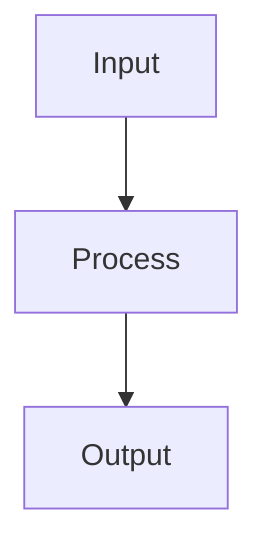

# Spec: {Feature Name}

> **Status**: Draft | Review | Approved | In Progress | Completed
> **Author**:
> **Created**:
> **Updated**:

## Overview

{Brief description of what this feature does - 2-3 sentences max}

## Problem Statement

{What problem does this solve? Why is it important?}

### Current State

{How does the system work today without this feature?}

### Desired State

{How should the system work after this feature is implemented?}

## Proposed Solution

{High-level description of the solution}

### Key Components

1. **Component A**: {description}
2. **Component B**: {description}

### Architecture Diagram



## Requirements

### Functional Requirements

| ID | Requirement | Priority |
|----|-------------|----------|
| FR-001 | {requirement} | Must Have |
| FR-002 | {requirement} | Should Have |
| FR-003 | {requirement} | Could Have |

### Non-Functional Requirements

| ID | Requirement | Target |
|----|-------------|--------|
| NFR-001 | Performance | < 200ms response time |
| NFR-002 | Availability | 99.9% uptime |
| NFR-003 | Security | OWASP Top 10 compliant |

## User Stories

### Story 1: {Title}

**As a** {role}
**I want to** {action}
**So that** {benefit}

#### Acceptance Criteria

- [ ] AC-001: {criterion}
- [ ] AC-002: {criterion}
- [ ] AC-003: {criterion}

## API Design

### Endpoints

```yaml
POST /api/v1/resource
  Request:
    - field1: string (required)
    - field2: number (optional)
  Response:
    - id: uuid
    - status: string
  Errors:
    - 400: Invalid input
    - 401: Unauthorized
    - 500: Internal error
```

## Data Model

### Entities

```yaml
Entity:
  id: UUID (PK)
  field1: string
  field2: number
  created_at: timestamp
  updated_at: timestamp
```

## Security Considerations

- [ ] Authentication required
- [ ] Authorization checks
- [ ] Input validation
- [ ] Rate limiting
- [ ] Audit logging

## Testing Strategy

### Unit Tests

- {test scenario 1}
- {test scenario 2}

### Integration Tests

- {test scenario 1}
- {test scenario 2}

### E2E Tests

- {test scenario 1}

## Out of Scope

- {item not included in this spec}
- {future enhancement}

## Dependencies

- {dependency 1}
- {dependency 2}

## Risks & Mitigations

| Risk | Impact | Probability | Mitigation |
|------|--------|-------------|------------|
| {risk} | High | Medium | {mitigation} |

## Open Questions

- [ ] {question 1}
- [ ] {question 2}

## Timeline

| Milestone | Date | Status |
|-----------|------|--------|
| Spec Approved | | Pending |
| Development Start | | Pending |
| Code Complete | | Pending |
| Testing Complete | | Pending |
| Release | | Pending |

---

## Appendix

### References

- {reference 1}
- {reference 2}

### Glossary

- **Term**: Definition
