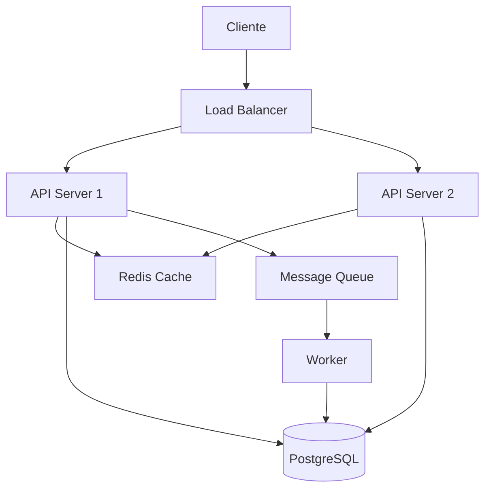

# Referencias e Fontes para System Design

Este documento lista fontes confiaveis para aprofundamento em system design.

## Fontes Primarias Recomendadas

### Repositorios de Referencia

| Fonte | URL | Uso |
|-------|-----|-----|
| System Design Primer | https://github.com/donnemartin/system-design-primer | Visao geral e estudo |
| Awesome Scalability | https://github.com/binhnguyennus/awesome-scalability | Catalogo de recursos |
| ByteByteGo | https://github.com/ByteByteGoHq/system-design-101 | Diagramas e explicacoes |

### Documentacao de Cloud Providers

| Provider | Centro de Arquitetura | Foco |
|----------|----------------------|------|
| AWS | https://aws.amazon.com/architecture/ | Patterns AWS-native |
| Google Cloud | https://cloud.google.com/architecture | Patterns GCP-native |
| Azure | https://learn.microsoft.com/azure/architecture/ | Patterns Azure-native |

### Papers Fundamentais

| Paper | Conceito | Leitura Obrigatoria Para |
|-------|----------|--------------------------|
| Dynamo (Amazon) | Eventual consistency, consistent hashing | NoSQL, sistemas distribuidos |
| Bigtable (Google) | Column-family stores | HBase, Cassandra |
| MapReduce (Google) | Processamento distribuido | Big data |
| Raft | Consenso distribuido | Sistemas distribuidos |
| CAP Theorem | Limitacoes fundamentais | Qualquer system design |

## Quando Consultar Cada Fonte

### Para Entrevistas
- System Design Primer - exemplos de problemas classicos
- ByteByteGo - visualizacoes claras

### Para Producao
- Documentacao do cloud provider em uso
- Case studies de empresas similares
- Benchmarks e metricas reais

### Para Aprofundamento Teorico
- Papers academicos
- Livros (Designing Data-Intensive Applications)

## Livros Recomendados

| Livro | Autor | Nivel |
|-------|-------|-------|
| Designing Data-Intensive Applications | Martin Kleppmann | Avancado |
| System Design Interview | Alex Xu | Intermediario |
| Building Microservices | Sam Newman | Intermediario |
| Site Reliability Engineering | Google | Avancado |
| Database Internals | Alex Petrov | Avancado |

## Blogs Tecnicos de Referencia

| Empresa | Blog | Topicos |
|---------|------|---------|
| Netflix | https://netflixtechblog.com | Streaming, microservices |
| Uber | https://www.uber.com/blog/engineering/ | Geolocation, real-time |
| Stripe | https://stripe.com/blog/engineering | Pagamentos, consistencia |
| Cloudflare | https://blog.cloudflare.com | CDN, edge computing |
| Discord | https://discord.com/blog | Real-time, scale |

## Ferramentas para Diagramas

| Ferramenta | Uso | Formato |
|------------|-----|---------|
| Excalidraw | Whiteboard style | PNG, SVG |
| Draw.io | Diagramas formais | PNG, SVG, XML |
| Mermaid | Diagramas em codigo | Markdown |
| PlantUML | UML em codigo | PNG, SVG |

### Exemplo Mermaid para Arquitetura

## Checklist de Validacao de Fontes

Antes de usar uma fonte como referencia:

- [ ] A fonte e de uma empresa/autor reconhecido?
- [ ] O conteudo esta atualizado (< 3 anos para tecnologia)?
- [ ] Ha evidencias praticas (nao apenas teoria)?
- [ ] O contexto e similar ao problema em questao?
- [ ] Ha consenso na comunidade sobre essa pratica?

## Aviso sobre Fontes

> **Cuidado com:**
> - Artigos patrocinados por vendors
> - "Best practices" sem contexto
> - Solucoes que resolvem problemas que voce nao tem
> - Hype de tecnologias novas sem track record

> **Preferir:**
> - Post-mortems de falhas (aprendizado real)
> - Case studies com metricas
> - Documentacao oficial
> - Experiencia propria e da equipe
