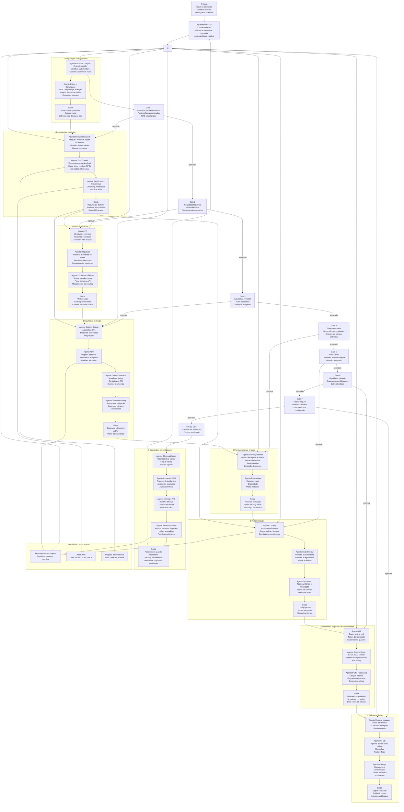

```mermaid
flowchart TD

%% Entrada
A[Entrada
Issue ou demanda
Contexto mínimo
Restrições e objetivos] --> B

%% Orquestração
B[Orquestrador SDLC
Coordena fases
Gerencia contexto e memória
Aplica políticas e gates] --> C

%% Fase 0: Preparação
subgraph P0[0 Preparação e alinhamento]
direction TB
P0a[Agente Intake e Triagem
Entende pedido
Identifica stakeholders
Classifica domínio e risco] --> P0b[Agente Policy e Compliance
LGPD, segurança, licenças
Regras de uso de dados
Restrições internas]
P0b --> P0c[Saída
Checklist de prontidão
Escopo inicial
Definições de done por fase]
end

C --> P0a --> D

%% Fase 1: Descoberta e pesquisa
subgraph P1[1 Descoberta e pesquisa]
direction TB
P1a[Agente Domain Research
Pesquisa termos e regras do domínio
Identifica fontes oficiais
Mapeia conceitos] --> P1b[Agente Doc Crawler
Varre documentação oficial
Capta links, versões, RFCs
Normaliza referências]
P1b --> P1c[Agente RAG Curator
Cria corpus
Chunking, metadados
Índices e filtros]
P1c --> P1d[Saída
Resumo do domínio
Fontes e links oficiais
Base RAG pronta]
end

D[Gate 1
Prontidão de conhecimento
Fontes oficiais registradas
RAG inicial criado] -->|aprovado| E
D -->|reprovar| P1a

P0c --> P1a
C --> P1a

%% Fase 2: Produto e requisitos
subgraph P2[2 Produto e requisitos]
direction TB
P2a[Agente PO
Objetivos e métricas
Personas e jornadas
Escopo e não escopo] --> P2b[Agente Requisitos
Histórias e critérios de aceite
Requisitos funcionais
Requisitos não funcionais]
P2b --> P2c[Agente UX Writer e Fluxos
Textos, estados, erros
Fluxo de tela e API
Mapeamento de eventos]
P2c --> P2d[Saída
PRD ou visão
Backlog estruturado
Critérios de aceite claros]
end

E[Gate 2
Requisitos testáveis
NFRs definidos
Riscos iniciais mapeados] -->|aprovado| F
E -->|reprovar| P2a

C --> P2a
P1d --> P2a

%% Fase 3: Arquitetura e design
subgraph P3[3 Arquitetura e design]
direction TB
P3a[Agente System Design
Arquitetura alvo
Trade offs e decisões
Integrações] --> P3b[Agente ADR
Registra decisões
Alternativas e impacto
Padrões adotados]
P3b --> P3c[Agente Data e Contratos
Modelo de dados
Contratos de API
Eventos e schemas]
P3c --> P3d[Agente Threat Modeling
Ameaças e mitigação
Controles e limites
Abuse cases]
P3d --> P3e[Saída
Diagrama e blueprint
ADRs
Plano de segurança]
end

F[Gate 3
Arquitetura revisada
ADRs completos
Ameaças mitigadas] -->|aprovado| G
F -->|reprovar| P3a

C --> P3a
P2d --> P3a
P1d --> P3a

%% Fase 4: Planejamento de entrega
subgraph P4[4 Planejamento de entrega]
direction TB
P4a[Agente Delivery Planner
Quebra em épicos e tarefas
Sequenciamento e dependências
Definição de marcos] --> P4b[Agente Estimativas
Esforço e risco
Capacidade
Plano de testes]
P4b --> P4c[Saída
Plano de execução
Sprint backlog inicial
Estratégia de release]
end

G[Gate 4
Plano executável
Dependências resolvidas
Critérios de release definidos] -->|aprovado| H
G -->|reprovar| P4a

C --> P4a
P3e --> P4a

%% Fase 5: Implementação
subgraph P5[5 Implementação]
direction TB
P5a[Agente Coding
Implementa features
Segue padrões do repo
Comita incrementalmente] --> P5b[Agente Code Review
Revisão automatizada
Padrões e legibilidade
Riscos e débitos]
P5b --> P5c[Agente Test Author
Testes unitários e integração
Testes de contrato
Dados de teste]
P5c --> P5d[Saída
Código pronto
Testes passando
Changelog técnico]
end

H[Gate 5
Build verde
Cobertura mínima atingida
Revisão aprovada] -->|aprovado| I
H -->|reprovar| P5a

C --> P5a
P4c --> P5a
P1d --> P5a

%% Fase 6: Qualidade, segurança e conformidade
subgraph P6[6 Qualidade, segurança e conformidade]
direction TB
P6a[Agente QA
Testes end to end
Testes de regressão
Exploratórios guiados] --> P6b[Agente Security Scan
SAST, SCA, secrets
Regras de dependências
Hardening] 
P6b --> P6c[Agente Perf e Resiliência
Carga e latência
Degradação graciosa
Timeouts e retries]
P6c --> P6d[Saída
Relatório de qualidade
Achados e correções
Sinal verde de release]
end

I[Gate 6
Qualidade validada
Segurança sem bloqueios
SLOs atendidos] -->|aprovado| J
I -->|reprovar| P6a

C --> P6a
P5d --> P6a

%% Fase 7: Release e deploy
subgraph P7[7 Release e deploy]
direction TB
P7a[Agente Release Manager
Notas de release
Checklist de deploy
Versionamento] --> P7b[Agente CI CD
Pipeline e infra como código
Migrações
Feature flags]
P7b --> P7c[Agente Change Management
Comunicação
Janela e rollback
Aprovações]
P7c --> P7d[Saída
Deploy realizado
Rollback pronto
Artefatos publicados]
end

J[Gate 7
Deploy seguro
Rollback validado
Observabilidade configurada] -->|aprovado| K
J -->|reprovar| P7a

C --> P7a
P6d --> P7a

%% Fase 8: Operação e aprendizagem
subgraph P8[8 Operação e aprendizagem]
direction TB
P8a[Agente Observabilidade
Dashboards e alertas
Logs e tracing
Golden signals] --> P8b[Agente Incident e RCA
Triagem de incidentes
Análise de causa raiz
Ações corretivas]
P8b --> P8c[Agente Metrics e ROI
DORA e SPACE
Custo e eficiência
Adoção e valor] --> P8d[Agente Memory Curator
Atualiza memória do projeto
Lições aprendidas
Padrões reutilizáveis]
P8d --> P8e[Saída
Postmortem quando necessário
Backlog de melhorias
Memória e playbooks atualizados]
end

K[Fim do ciclo
Sistema em produção
Feedback coletado] --> P8a
P8e --> B

%% Artefatos e memória
subgraph MB[Memória e conhecimento]
direction TB
M1[Memory Bank do projeto
Decisões, contexto, padrões]
M2[Base RAG
Docs oficiais, ADRs, PRDs]
M3[Registro de evidências
Links, versões, hashes]
end

C --- M1
P1c --- M2
P1b --- M3
P3b --- M1
P8d --- M1
P5a --- M1
```